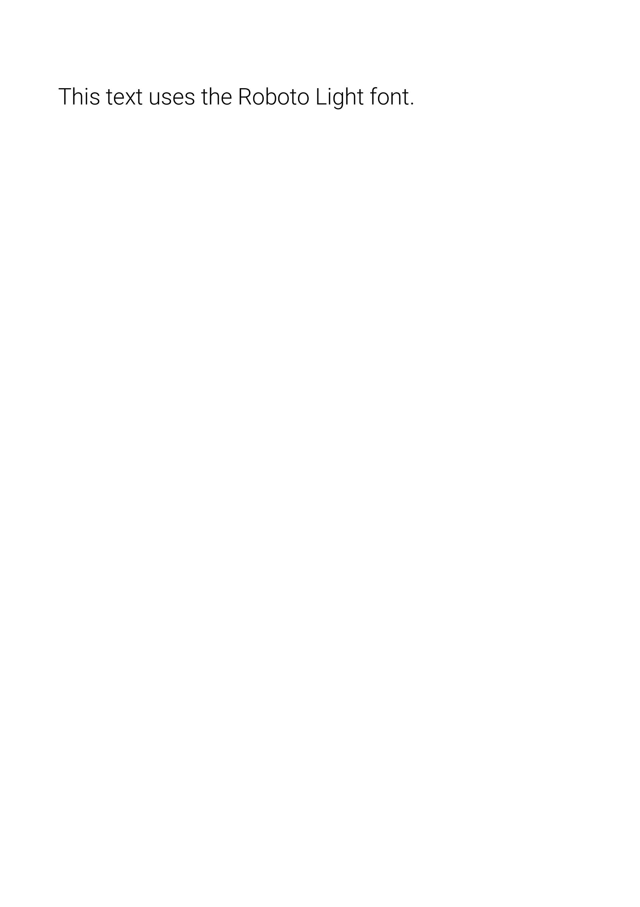

Allows adding CSS to the document while securely parsing and escaping it.

NB: While you can add regular CSS with the `<style>` tag, it's recommended to use the `CSS` component to ensure that the CSS is properly escaped, most notably when using URLs or other potentially unsafe content.

## CSS

### Examples

#### Preview

Use a simple CSS print property to set the page size.

<Frame type="glass"></Frame>

<div style={{paddingTop: "1rem", paddingBottom: "1rem"}}><CodeGroup>
```jsx template.tsx
import { CSS } from "@onedoc/react-print";

<CSS>{`@page { size: a4 landscape; }`}</CSS>;

```
```css base.css
@import url("https://fonts.googleapis.com/css2?family=Inter:wght@400;700&display=swap");

html,
body {
  font-size: 28px;
  font-family: "Inter", sans-serif;
}

@page {
  size: A4;
}

```
</CodeGroup></div>

#### Load a Google Font

Load a Google Font using the `@import` rule.

<Frame type="glass"></Frame>

<div style={{paddingTop: "1rem", paddingBottom: "1rem"}}><CodeGroup>
```jsx template.tsx
import { CSS } from "@onedoc/react-print";

<React.Fragment>
  <CSS>
    {`@import url('https://fonts.googleapis.com/css2?family=Roboto:wght@300&display=swap');`}
  </CSS>
  <p style={{ fontFamily: "Roboto, sans-serif" }}>
    This text uses the Roboto Light font.
  </p>
</React.Fragment>;

```
```css base.css
@import url("https://fonts.googleapis.com/css2?family=Inter:wght@400;700&display=swap");

html,
body {
  font-size: 28px;
  font-family: "Inter", sans-serif;
}

@page {
  size: A4;
}

```
</CodeGroup></div>

#### Layout

You can use the `@page` at-rule in CSS to manage all aspects of printed pages. More on this [here](https://developer.mozilla.org/en-US/docs/Web/CSS/@page).

<Frame type="glass"></Frame>

<div style={{paddingTop: "1rem", paddingBottom: "1rem"}}><CodeGroup>
```jsx template.tsx
import { CSS } from "@onedoc/react-print";

<React.Fragment>
  <CSS>{`@page {size: A4;margin-top:1cm;margin-right:1cm;margin-left:1cm;margin-bottom:1cm;`}</CSS>
  <Tailwind>
    <div className="h-screen w-full border-8 border-gray-950"></div>
  </Tailwind>
</React.Fragment>;

```
```css base.css
@import url("https://fonts.googleapis.com/css2?family=Inter:wght@400;700&display=swap");

html,
body {
  font-size: 28px;
  font-family: "Inter", sans-serif;
}

@page {
  size: A4;
}

```
</CodeGroup></div>

