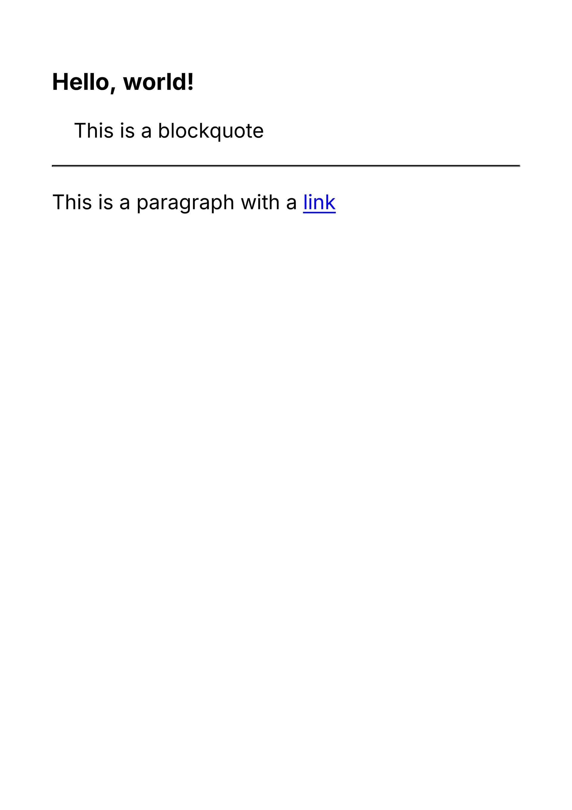
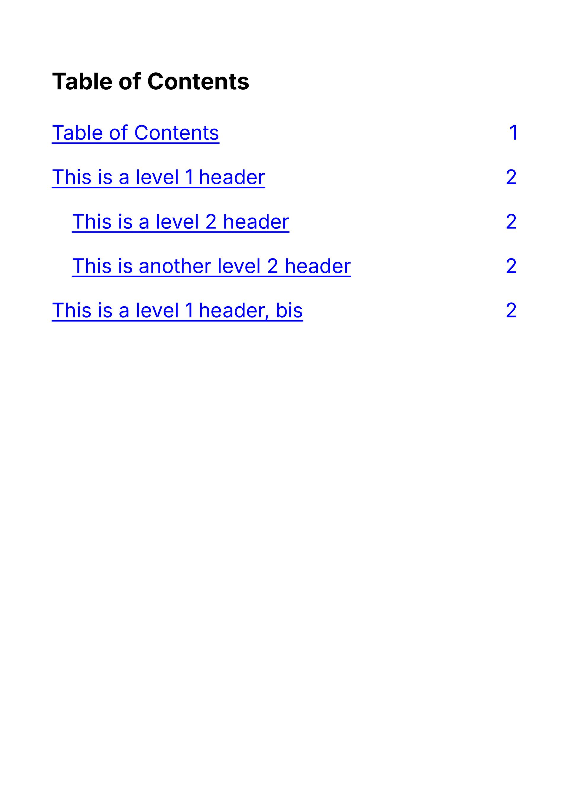

Support

<div style={{
    display: "grid",
    gridTemplateColumns: "repeat(2, 1fr)",
    gap: "0.5rem",
  }}><div className="flex items-center p-3 border rounded-md border-gray-700" style={{borderColor: '#374151'}}><svg xmlns="http://www.w3.org/2000/svg" className="h-5 w-5 mr-2" viewBox="0 0 512 512"><path fill="#22c55e" d="M256 512A256 256 0 1 0 256 0a256 256 0 1 0 0 512zM369 209L241 337c-9.4 9.4-24.6 9.4-33.9 0l-64-64c-9.4-9.4-9.4-24.6 0-33.9s24.6-9.4 33.9 0l47 47L335 175c9.4-9.4 24.6-9.4 33.9 0s9.4 24.6 0 33.9z"/></svg><span>Client-side</span></div><div className="flex items-center p-3 border rounded-md" style={{borderColor: '#374151'}}><svg xmlns="http://www.w3.org/2000/svg" className="h-5 w-5 mr-2" viewBox="0 0 512 512"><path fill="#22c55e" d="M256 512A256 256 0 1 0 256 0a256 256 0 1 0 0 512zM369 209L241 337c-9.4 9.4-24.6 9.4-33.9 0l-64-64c-9.4-9.4-9.4-24.6 0-33.9s24.6-9.4 33.9 0l47 47L335 175c9.4-9.4 24.6-9.4 33.9 0s9.4 24.6 0 33.9z"/></svg><span>Server-side</span></div></div>

#### Preview

Use a simple Markdown tag to support Markdown in your document.

<Frame background="subtle"></Frame>

<div style={{paddingTop: "1rem", paddingBottom: "1rem"}}><CodeBlocks>
<CodeBlock title="template.tsx">
```jsx
import { Markdown } from "@fileforge/react-print";

<Markdown>{`# Hello, world!

> This is a blockquote

---

This is a paragraph with a [link](https://google.com)`}</Markdown>;

```
</CodeBlock>
<CodeBlock title="styles.css">
```css
@import url("https://fonts.googleapis.com/css2?family=Inter:wght@400;700&display=swap");

html,
body {
  font-size: 28px;
  font-family: "Inter", sans-serif;
}

@page {
  size: A4;
}

```
</CodeBlock>
</CodeBlocks></div>

### Examples

#### Custom Components and Variables

You can leverage the `overrides` prop to replace Markdown components with your own components. This is useful for custom components or even for dynamic content.

<Frame background="subtle"></Frame>

<div style={{paddingTop: "1rem", paddingBottom: "1rem"}}><CodeBlocks>
<CodeBlock title="template.tsx">
```jsx
import { Markdown } from "@fileforge/react-print";

<Markdown
  options={{
    overrides: {
      Title: {
        component: () => "Non-Disclosure Agreement",
      },
      CustomerName: {
        component: () => "John Doe",
      },
      KPI: {
        component: ({ children }: { children: React.ReactNode }) => (
          <div style={{ color: "blue", fontSize: "2rem" }}>{children}</div>
        ),
      },
    },
  }}
>{`# <Title />

This agreement is signed with <CustomerName />.

<KPI>20/month</KPI>`}</Markdown>;

```
</CodeBlock>
<CodeBlock title="styles.css">
```css
@import url("https://fonts.googleapis.com/css2?family=Inter:wght@400;700&display=swap");

html,
body {
  font-size: 28px;
  font-family: "Inter", sans-serif;
}

@page {
  size: A4;
}

```
</CodeBlock>
</CodeBlocks></div>

#### Table of Contents

You can use the `tocRenderer` prop to render a table of contents from your Markdown content. The headers will be automatically detected and rendered in the order they appear. You need to place the `<Toc />` component in your Markdown content to render the table of contents.

<Frame background="subtle"></Frame>

<div style={{paddingTop: "1rem", paddingBottom: "1rem"}}><CodeBlocks>
<CodeBlock title="template.tsx">
```jsx
import { Markdown } from "@fileforge/react-print";

<Tailwind
  config={{
    corePlugins: {
      preflight: false,
    },
  }}
>
  <CSS>{`a.-toc-link:after {
                content: target-counter(attr(href), page);
                float: right;
              }`}</CSS>
  <Markdown
    options={{
      overrides: {
        PageBreak: {
          component: PageBreak, // import { PageBreak } from "@fileforge/react-print";
        },
      },
    }}
    tocRenderer={({ level, children, id }) => (
      <a
        className="block py-2 border-b -toc-link"
        style={{
          paddingLeft: `${(level - 1) * 1}rem`,
        }}
        href={`#${id}`}
      >
        {children}
      </a>
    )}
  >{`# Table of Contents

<Toc />

<PageBreak />

# This is a level 1 header

## This is a level 2 header

Lorem ipsum dolor sit amet, consectetur adipiscing elit. Sed non risus. Suspendisse lectus tortor, dignissim sit amet, adipiscing nec, ultricies sed, dolor. Cras elementum ultrices diam. Maecenas ligula massa, varius a, semper congue, euismod non, mi.

## This is another level 2 header

Lorem ipsum dolor sit amet, consectetur adipiscing elit. Sed non risus. Suspendisse lectus tortor, dignissim sit amet, adipiscing nec, ultricies sed, dolor. Cras elementum ultrices diam. Maecenas ligula massa, varius a, semper congue, euismod non, mi.

# This is a level 1 header, bis

Lorem ipsum dolor sit amet, consectetur adipiscing elit. Sed non risus. Suspendisse lectus tortor, dignissim sit amet, adipiscing nec, ultricies sed, dolor. Cras elementum ultrices diam. Maecenas ligula massa, varius a, semper congue, euismod non, mi.`}</Markdown>
</Tailwind>;

```
</CodeBlock>
<CodeBlock title="styles.css">
```css
@import url("https://fonts.googleapis.com/css2?family=Inter:wght@400;700&display=swap");

html,
body {
  font-size: 28px;
  font-family: "Inter", sans-serif;
}

@page {
  size: A4;
}

```
</CodeBlock>
</CodeBlocks></div>

