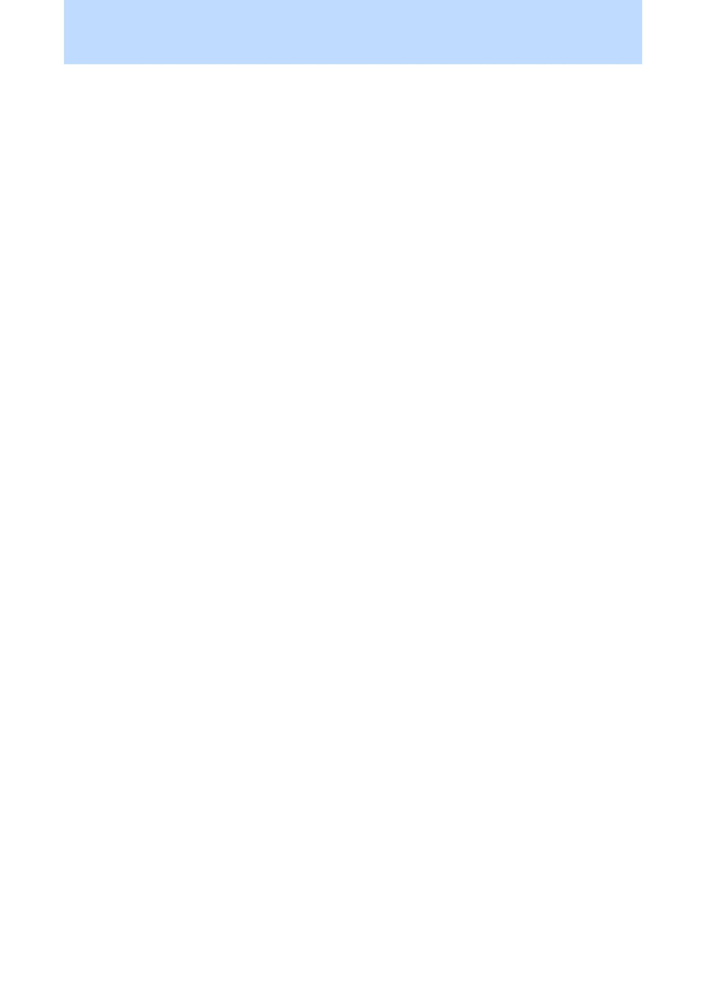

## PageTop

Support

<div style={{
    display: "grid",
    gridTemplateColumns: "repeat(2, 1fr)",
    gap: "0.5rem",
  }}><div className="flex items-center p-3 border rounded-md border-gray-700" style={{borderColor: '#374151'}}><svg xmlns="http://www.w3.org/2000/svg" className="h-5 w-5 mr-2" viewBox="0 0 512 512"><path fill="#22c55e" d="M256 512A256 256 0 1 0 256 0a256 256 0 1 0 0 512zM369 209L241 337c-9.4 9.4-24.6 9.4-33.9 0l-64-64c-9.4-9.4-9.4-24.6 0-33.9s24.6-9.4 33.9 0l47 47L335 175c9.4-9.4 24.6-9.4 33.9 0s9.4 24.6 0 33.9z"/></svg><span>Client-side</span></div><div className="flex items-center p-3 border rounded-md" style={{borderColor: '#374151'}}><svg xmlns="http://www.w3.org/2000/svg" className="h-5 w-5 mr-2" viewBox="0 0 512 512"><path fill="#22c55e" d="M256 512A256 256 0 1 0 256 0a256 256 0 1 0 0 512zM369 209L241 337c-9.4 9.4-24.6 9.4-33.9 0l-64-64c-9.4-9.4-9.4-24.6 0-33.9s24.6-9.4 33.9 0l47 47L335 175c9.4-9.4 24.6-9.4 33.9 0s9.4 24.6 0 33.9z"/></svg><span>Server-side</span></div></div>

Displays content in the top of all the pages.

This component should be placed as early as possible in the document and will apply to all subsequent pages.

### Examples

#### Preview

<Frame type="glass"></Frame>

<div style={{paddingTop: "1rem", paddingBottom: "1rem"}}><CodeGroup>
```jsx template.tsx
import { PageTop } from "@onedoc/react-print";

<PageTop style={{ backgroundColor: "#bfdbfe" }} />;

```
```css base.css
@import url("https://fonts.googleapis.com/css2?family=Inter:wght@400;700&display=swap");

html,
body {
  font-size: 28px;
  font-family: "Inter", sans-serif;
}

@page {
  size: A4;
}

```
</CodeGroup></div>

## CurrentPageTop

Support

<div style={{
    display: "grid",
    gridTemplateColumns: "repeat(2, 1fr)",
    gap: "0.5rem",
  }}><div className="flex items-center p-3 border rounded-md border-gray-700" style={{borderColor: '#374151'}}><svg xmlns="http://www.w3.org/2000/svg" className="h-5 w-5 mr-2" viewBox="0 0 512 512"><path fill="#22c55e" d="M256 512A256 256 0 1 0 256 0a256 256 0 1 0 0 512zM369 209L241 337c-9.4 9.4-24.6 9.4-33.9 0l-64-64c-9.4-9.4-9.4-24.6 0-33.9s24.6-9.4 33.9 0l47 47L335 175c9.4-9.4 24.6-9.4 33.9 0s9.4 24.6 0 33.9z"/></svg><span>Client-side</span></div><div className="flex items-center p-3 border rounded-md" style={{borderColor: '#374151'}}><svg xmlns="http://www.w3.org/2000/svg" className="h-5 w-5 mr-2" viewBox="0 0 512 512"><path fill="#22c55e" d="M256 512A256 256 0 1 0 256 0a256 256 0 1 0 0 512zM369 209L241 337c-9.4 9.4-24.6 9.4-33.9 0l-64-64c-9.4-9.4-9.4-24.6 0-33.9s24.6-9.4 33.9 0l47 47L335 175c9.4-9.4 24.6-9.4 33.9 0s9.4 24.6 0 33.9z"/></svg><span>Server-side</span></div></div>

Displays content in the top of the current page.

This component will override the content of the `PageTop` component for the current page.

```jsx
import { CurrentPageTop } from "@onedoc/react-print";
```

## PageBottom

Support

<div style={{
    display: "grid",
    gridTemplateColumns: "repeat(2, 1fr)",
    gap: "0.5rem",
  }}><div className="flex items-center p-3 border rounded-md border-gray-700" style={{borderColor: '#374151'}}><svg xmlns="http://www.w3.org/2000/svg" className="h-5 w-5 mr-2" viewBox="0 0 512 512"><path fill="#22c55e" d="M256 512A256 256 0 1 0 256 0a256 256 0 1 0 0 512zM369 209L241 337c-9.4 9.4-24.6 9.4-33.9 0l-64-64c-9.4-9.4-9.4-24.6 0-33.9s24.6-9.4 33.9 0l47 47L335 175c9.4-9.4 24.6-9.4 33.9 0s9.4 24.6 0 33.9z"/></svg><span>Client-side</span></div><div className="flex items-center p-3 border rounded-md" style={{borderColor: '#374151'}}><svg xmlns="http://www.w3.org/2000/svg" className="h-5 w-5 mr-2" viewBox="0 0 512 512"><path fill="#22c55e" d="M256 512A256 256 0 1 0 256 0a256 256 0 1 0 0 512zM369 209L241 337c-9.4 9.4-24.6 9.4-33.9 0l-64-64c-9.4-9.4-9.4-24.6 0-33.9s24.6-9.4 33.9 0l47 47L335 175c9.4-9.4 24.6-9.4 33.9 0s9.4 24.6 0 33.9z"/></svg><span>Server-side</span></div></div>

Displays content in the bottom of all the pages.

### Examples

#### Preview

<Frame type="glass"></Frame>

<div style={{paddingTop: "1rem", paddingBottom: "1rem"}}><CodeGroup>
```jsx template.tsx
import { PageBottom } from "@onedoc/react-print";

<PageBottom style={{ backgroundColor: "#bfdbfe" }} />;

```
```css base.css
@import url("https://fonts.googleapis.com/css2?family=Inter:wght@400;700&display=swap");

html,
body {
  font-size: 28px;
  font-family: "Inter", sans-serif;
}

@page {
  size: A4;
}

```
</CodeGroup></div>

## PageBreak

Support

<div style={{
    display: "grid",
    gridTemplateColumns: "repeat(2, 1fr)",
    gap: "0.5rem",
  }}><div className="flex items-center p-3 border rounded-md border-gray-700" style={{borderColor: '#374151'}}><svg xmlns="http://www.w3.org/2000/svg" className="h-5 w-5 mr-2" viewBox="0 0 512 512"><path fill="#22c55e" d="M256 512A256 256 0 1 0 256 0a256 256 0 1 0 0 512zM369 209L241 337c-9.4 9.4-24.6 9.4-33.9 0l-64-64c-9.4-9.4-9.4-24.6 0-33.9s24.6-9.4 33.9 0l47 47L335 175c9.4-9.4 24.6-9.4 33.9 0s9.4 24.6 0 33.9z"/></svg><span>Client-side</span></div><div className="flex items-center p-3 border rounded-md" style={{borderColor: '#374151'}}><svg xmlns="http://www.w3.org/2000/svg" className="h-5 w-5 mr-2" viewBox="0 0 512 512"><path fill="#22c55e" d="M256 512A256 256 0 1 0 256 0a256 256 0 1 0 0 512zM369 209L241 337c-9.4 9.4-24.6 9.4-33.9 0l-64-64c-9.4-9.4-9.4-24.6 0-33.9s24.6-9.4 33.9 0l47 47L335 175c9.4-9.4 24.6-9.4 33.9 0s9.4 24.6 0 33.9z"/></svg><span>Server-side</span></div></div>

Forces a page break.

```jsx
import { PageBreak } from "@onedoc/react-print";
```

## NoBreak

Support

<div style={{
    display: "grid",
    gridTemplateColumns: "repeat(2, 1fr)",
    gap: "0.5rem",
  }}><div className="flex items-center p-3 border rounded-md border-gray-700" style={{borderColor: '#374151'}}><svg xmlns="http://www.w3.org/2000/svg" className="h-5 w-5 mr-2" viewBox="0 0 512 512"><path fill="#22c55e" d="M256 512A256 256 0 1 0 256 0a256 256 0 1 0 0 512zM369 209L241 337c-9.4 9.4-24.6 9.4-33.9 0l-64-64c-9.4-9.4-9.4-24.6 0-33.9s24.6-9.4 33.9 0l47 47L335 175c9.4-9.4 24.6-9.4 33.9 0s9.4 24.6 0 33.9z"/></svg><span>Client-side</span></div><div className="flex items-center p-3 border rounded-md" style={{borderColor: '#374151'}}><svg xmlns="http://www.w3.org/2000/svg" className="h-5 w-5 mr-2" viewBox="0 0 512 512"><path fill="#22c55e" d="M256 512A256 256 0 1 0 256 0a256 256 0 1 0 0 512zM369 209L241 337c-9.4 9.4-24.6 9.4-33.9 0l-64-64c-9.4-9.4-9.4-24.6 0-33.9s24.6-9.4 33.9 0l47 47L335 175c9.4-9.4 24.6-9.4 33.9 0s9.4 24.6 0 33.9z"/></svg><span>Server-side</span></div></div>

Prevents a page break. Wrap this component around content that should not be broken across pages.

```jsx
import { NoBreak } from "@onedoc/react-print";
```

## FloatBottom

Support

<div style={{
    display: "grid",
    gridTemplateColumns: "repeat(2, 1fr)",
    gap: "0.5rem",
  }}><div className="flex items-center p-3 border rounded-md border-gray-700" style={{borderColor: '#374151'}}><svg xmlns="http://www.w3.org/2000/svg" className="h-5 w-5 mr-2" viewBox="0 0 512 512"><path fill="#22c55e" d="M256 512A256 256 0 1 0 256 0a256 256 0 1 0 0 512zM369 209L241 337c-9.4 9.4-24.6 9.4-33.9 0l-64-64c-9.4-9.4-9.4-24.6 0-33.9s24.6-9.4 33.9 0l47 47L335 175c9.4-9.4 24.6-9.4 33.9 0s9.4 24.6 0 33.9z"/></svg><span>Client-side</span></div><div className="flex items-center p-3 border rounded-md" style={{borderColor: '#374151'}}><svg xmlns="http://www.w3.org/2000/svg" className="h-5 w-5 mr-2" viewBox="0 0 512 512"><path fill="#22c55e" d="M256 512A256 256 0 1 0 256 0a256 256 0 1 0 0 512zM369 209L241 337c-9.4 9.4-24.6 9.4-33.9 0l-64-64c-9.4-9.4-9.4-24.6 0-33.9s24.6-9.4 33.9 0l47 47L335 175c9.4-9.4 24.6-9.4 33.9 0s9.4 24.6 0 33.9z"/></svg><span>Server-side</span></div></div>

Floats the content to the bottom of the page.

### Examples

#### Preview

<Frame type="glass"></Frame>

<div style={{paddingTop: "1rem", paddingBottom: "1rem"}}><CodeGroup>
```jsx template.tsx
import { FloatBottom } from "@onedoc/react-print";

<FloatBottom>Here are some floated contents</FloatBottom>;

```
```css base.css
@import url("https://fonts.googleapis.com/css2?family=Inter:wght@400;700&display=swap");

html,
body {
  font-size: 28px;
  font-family: "Inter", sans-serif;
}

@page {
  size: A4;
}

```
</CodeGroup></div>

