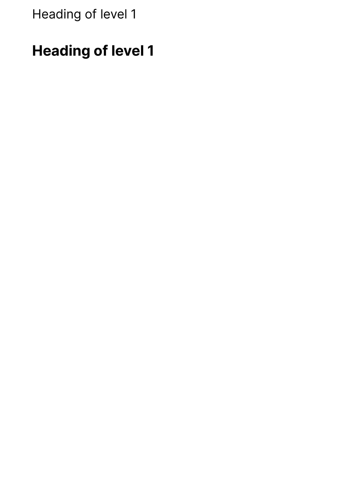

Returns the current page's running header of level 1.

Support

<div style={{
    display: "grid",
    gridTemplateColumns: "repeat(2, 1fr)",
    gap: "0.5rem",
  }}><div className="flex items-center p-3 border rounded-md border-gray-700" style={{borderColor: '#374151'}}><svg xmlns="http://www.w3.org/2000/svg" className="h-5 w-5 mr-2" viewBox="0 0 512 512"><path fill="#22c55e" d="M256 512A256 256 0 1 0 256 0a256 256 0 1 0 0 512zM369 209L241 337c-9.4 9.4-24.6 9.4-33.9 0l-64-64c-9.4-9.4-9.4-24.6 0-33.9s24.6-9.4 33.9 0l47 47L335 175c9.4-9.4 24.6-9.4 33.9 0s9.4 24.6 0 33.9z"/></svg><span>Client-side</span></div><div className="flex items-center p-3 border rounded-md" style={{borderColor: '#374151'}}><svg xmlns="http://www.w3.org/2000/svg" className="h-5 w-5 mr-2" viewBox="0 0 512 512"><path fill="#22c55e" d="M256 512A256 256 0 1 0 256 0a256 256 0 1 0 0 512zM369 209L241 337c-9.4 9.4-24.6 9.4-33.9 0l-64-64c-9.4-9.4-9.4-24.6 0-33.9s24.6-9.4 33.9 0l47 47L335 175c9.4-9.4 24.6-9.4 33.9 0s9.4 24.6 0 33.9z"/></svg><span>Server-side</span></div></div>

#### Preview

Show the current running header of level 1 in the page header. All running headers are reset when any of their parent headings are encountered (e.g. a level 2 heading resets the level 3, 4, 5 and 6 headings).

<Frame type="glass"></Frame>

<div style={{paddingTop: "1rem", paddingBottom: "1rem"}}><CodeBlocks>
<CodeBlock title="template.tsx">
```jsx
import { RunningH1 } from "@onedoc/react-print";

<React.Fragment>
  <PageTop style={{ paddingTop: "1rem" }}>
    <RunningH1 />
  </PageTop>
  <h1>Heading of level 1</h1>
</React.Fragment>;

```
</CodeBlock>
<CodeBlock title="styles.css">
```css
@import url("https://fonts.googleapis.com/css2?family=Inter:wght@400;700&display=swap");

html,
body {
  font-size: 28px;
  font-family: "Inter", sans-serif;
}

@page {
  size: A4;
}

```
</CodeBlock>
</CodeBlocks></div>

### Examples

