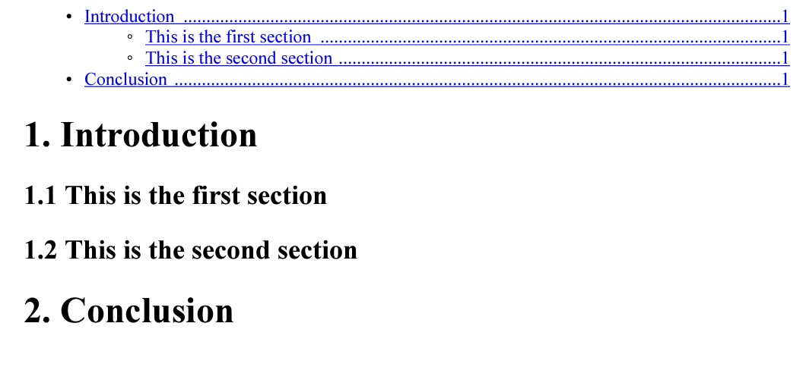

Fileforge's PDF generation API supports rich cross-referencing capabilities. This allows you to create links between different parts of your document, such as linking to a specific section or page.

## Cross-linking

Similarly to HTML, Fileforge automatically parses local links in your document.

```html
<a href="#section-1">Go to section 1</a>
<!-- Will be clickable in the final PDF -->
<a href="https://google.com">Go to google.com</a>

<section id="section-1">
  <!-- The content of section 1, which can be on any page -->
</section>
```

This also works in elements contained in the page shell, such as headers and footers.

<Tabs>
<Tab title="react-print">
```tsx
const Document = () => {
  return <>
    <PageBottom>
      <a href="#cover">Go to first page</a>
    </PageBottom>
    <section id="cover">
      <h1>Cover page</h1>
    </section>
  </>
}
```
</Tab>
</Tabs>

## Pointers

### Counters

When adding cross-references to PDFs, you may want to consider their printed page number. Fileforge provides a `page` counter that you can use to reference the page number.

```html
<style>
a:after {
  content: " (see page " target-counter(attr(href), page) ")";
}
</style>

<a href="#section-1">Section 1</a>
<!-- Will show Section 1 (see page 1) -->

<section id="section-1">
  <!-- The content of section 1, which can be on any page -->
</section>
```

You can also reference custom counters, such as a section number.

```html
<style>
  html {
    counter-reset: section;
  }

  section {
    counter-increment: section;
  }

  section::before {
    content: "Section " counter(section) ": ";
  }

  a:after {
    content: " (see section " target-counter(attr(href), section) ")";
  }
</style>

<a href="#section-1">Section 1</a>
<!-- Will show Section 1 (see section 1) -->

<section id="section-1">
  <!-- The content of section 1, which can be on any page -->
</section>
```

### Names

You can also use the contents of a target element to reference it. For example, you may want to display `(see "Cover page")` instead of `(see page 1)`.

<Callout intent="note" title="Target Content">
  Since the target content will be inlined, we recommend adding the ID to headers rather than sections or divs.
</Callout>

```html
<style>
a:after {
  content: " (see \"" target-content(attr(href)) "\")";
}
</style>

<a href="#cover">Cover page</a>

<section>
  <h1 id="cover">Cover page</h1>
  <!-- The content of the cover page -->
</section>
```

## Example: Table of Contents

You can combine the above functionality to build a table of contents that automatically updates with the page numbers.

```html
<style>
html {
  counter-reset: chapter;
}

h1::before {
  content: counter(chapter) ". ";
  counter-increment: chapter;
}

h1 {
  counter-reset: section;
}

h2 {
  counter-increment: section;
}

h2::before {
  content: counter(chapter) "." counter(section) " ";
}

a::after {
  content:  target-content(attr(href)) " " leader(".") target-counter(attr(href), page);
}
</style>

<ul>
  <li>
    <a href="#chapter-1"></a>
    <ul>
      <li>
        <a href="#section-1"></a>
      </li>
      <li>
        <a href="#section-2"></a>
      </li>
    </ul>
  </li>
  <li>
    <a href="#chapter-2"></a>
  </li>
</ul>

<h1 id="chapter-1">Introduction</h1>

<h2 id="section-1">This is the first section</h2>

<h2 id="section-2">This is the second section</h2>

<h1 id="chapter-2">Conclusion</h1>
```

This will yeld the following table of contents:

<Frame background="subtle">

</Frame>
