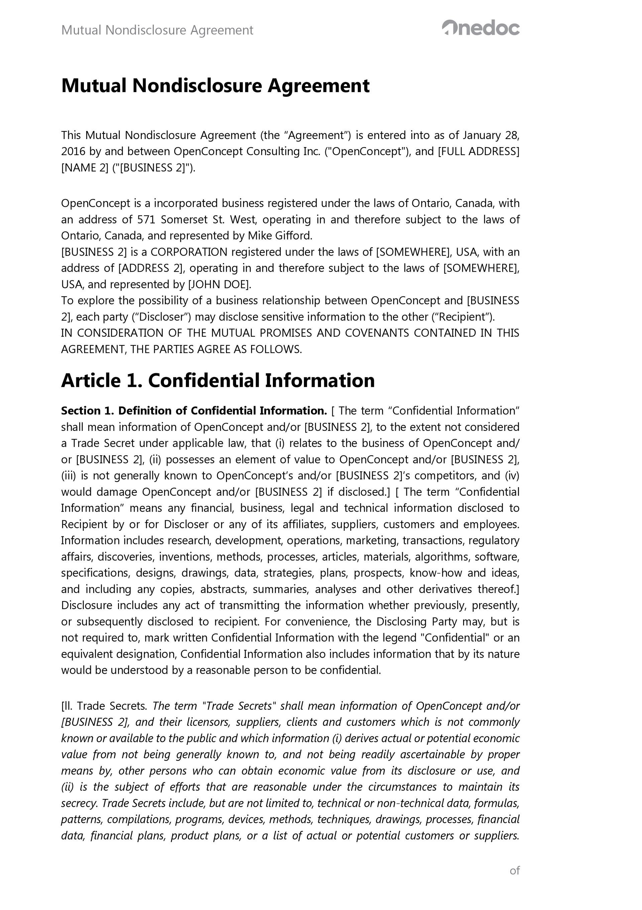

## Reports

<CardGroup>
 <Card title="Scientific" href="../../../ui/templates/scientific-report">
      

        
      

    </Card>
 <Card title="With charts" href="../../../ui/templates/report-charts">
      

        
      

    </Card>
</CardGroup>

## Receipts

<CardGroup>
 <Card title="Receipt" href="../../../ui/templates/receipt">
      

        
      

    </Card>
</CardGroup>

## NDA

<CardGroup>
 <Card title="NDA Markdown" href="../../../ui/templates/nda-markdown">
      

        
      

    </Card>
</CardGroup>

## Invoices

<CardGroup>
 <Card title="Basic" href="../../../ui/templates/invoice">
      

        
      

    </Card>
 <Card title="Advanced with QR" href="../../../ui/templates/invoice-advanced">
      

        
      

    </Card>
</CardGroup>

