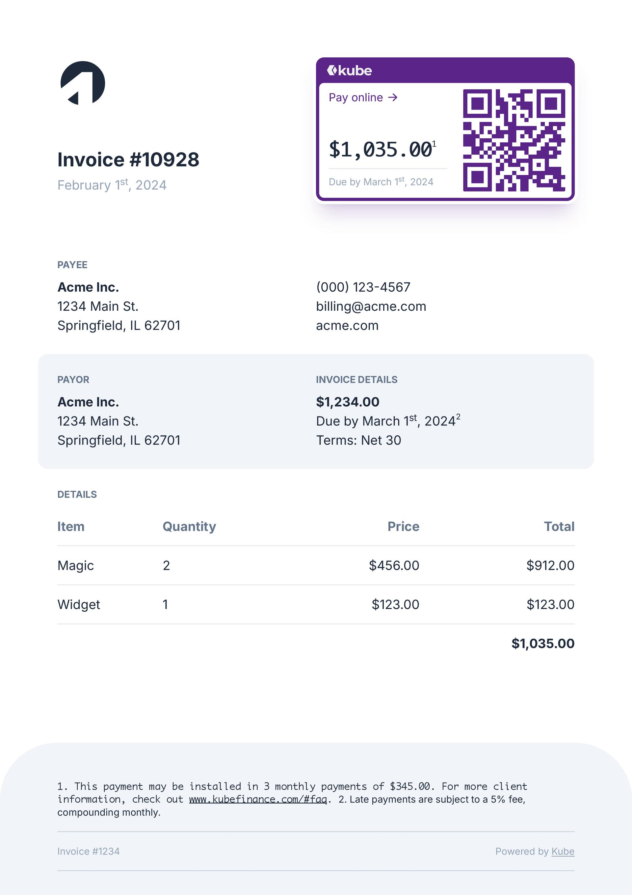

<Frame background="subtle"></Frame>

```jsx
import { Footnote, PageBottom, Tailwind, CSS } from "@fileforge/react-print";
import { QRCodeSVG } from "qrcode.react";
import { ArrowRightIcon } from "@heroicons/react/20/solid";

<Tailwind>
  <CSS>
    {`@import url('https://fonts.googleapis.com/css2?family=Inter:wght@400;700&display=swap');

      @page {
        size: a4;
        margin: .75in .75in 1in .75in;
      }
      `}
  </CSS>
  <div className="font-[inter] text-slate-800">
    <div className="bg-slate-100 -z-10 absolute -bottom-[1in] -right-[.75in] -left-[.75in] rounded-t-[.75in] h-[20vh]"></div>
    <PageBottom>
      <div className="text-xs text-slate-400 border-t border-t-slate-300 py-4 mt-4 flex border-b border-b-slate-300">
        <div>Invoice #1234</div>
        <div className="flex-grow" />
        <div>
          Powered by{" "}
          <a
            href="https://kubefinance.com"
            target="_blank"
            className="underline underline-offset-2 "
          >
            Kube
          </a>
        </div>
      </div>
    </PageBottom>
    <div className="flex items-start">
      <div>
        <svg
          version="1.1"
          id="Layer_1"
          xmlns="http://www.w3.org/2000/svg"
          x="0px"
          y="0px"
          viewBox="0 0 24 24"
          className="w-16 mb-12 fill-slate-800"
        >
          <g>
            <path
              d="M22.45,12.12c0-2.91-0.99-5.33-3.03-7.34C17.42,2.76,14.96,1.74,12,1.74c-2.93,0-5.4,1.02-7.43,3.05
            C2.56,6.8,1.55,9.26,1.55,12.15c0,0.84,0.11,1.63,0.27,2.37l9.71-7.65h5.01v14.58c1.06-0.5,2.03-1.13,2.91-1.99
            C21.46,17.45,22.45,15.01,22.45,12.12z"
            />
            <path d="M4.91,19.78c1.4,1.26,3.03,2.12,4.9,2.48v-6.32L4.91,19.78z" />
          </g>
        </svg>
        <h1 className="text-2xl font-bold">Invoice #10928</h1>
        <p className="text-slate-400 mb-8 pt-1">
          February 1<sup>st</sup>, 2024
        </p>
      </div>
      <div className="flex-grow" />
      <div className="bg-[#5a2489] shadow-xl ring-white ring-4 shadow-[#5a2489]/20 text-white p-1  rounded-[0.625rem] w-1/2">
        <div className="flex items-center text-xs text-white">
          
        </div>
        <div className="flex bg-white rounded-md text-slate-800 items-stretch">
          <div className="flex-grow flex flex-col p-3 pt-2">
            <div className="text-sm text-[#5a2489] flex items-center">
              Pay online
              <ArrowRightIcon className="h-4 fill-current ml-1" />
            </div>
            <div className="basis-0 flex-grow" />
            <div className="text-2xl font-mono font-bold pb-2">
              $1,035.00
              <Footnote style={{ footnoteDisplay: "inline" }}>
                This payment may be installed in 3 monthly payments of $345.00.
                For more client information, check out{" "}
                <a
                  href="https://www.kubefinance.com/"
                  target="_blank"
                  className="underline"
                >
                  www.kubefinance.com/#faq
                </a>
                .
              </Footnote>
            </div>
            <div className="text-xs text-slate-400 border-t border-t-slate-200 pt-2">
              Due by March 1<sup>st</sup>, 2024
            </div>
          </div>
          <div>
            <div className="p-2 bg-white rounded-md">
              <QRCodeSVG
                className="h-32 rounded-sm overflow-hidden"
                value="https://www.kubefinance.com/"
                size={128}
                bgColor="white"
                fgColor="#5a2489"
              />
            </div>
          </div>
        </div>
      </div>
    </div>
    <div className="p-6 rounded-xl mt-6 -mx-6">
      <h2 className="mb-2 text-xs font-bold text-slate-500 uppercase">Payee</h2>
      <div className="flex">
        <div className="basis-0 flex-grow gap-4">
          <h2 className="font-bold">Acme Inc.</h2>
          1234 Main St.
          <br />
          Springfield, IL 62701
        </div>
        <div className="basis-0 flex-grow">
          (000) 123-4567
          <br />
          billing@acme.com
          <br />
          acme.com
        </div>
      </div>
    </div>
    <div className="p-6 bg-slate-100 rounded-xl -mx-6 mb-6">
      <div className="flex">
        <div className="basis-0 flex-grow gap-4">
          <h2 className="mb-2 text-xs font-bold text-slate-500 uppercase">
            Payor
          </h2>
          <h2 className="font-bold">Acme Inc.</h2>
          1234 Main St.
          <br />
          Springfield, IL 62701
        </div>
        <div className="basis-0 flex-grow">
          <h2 className="mb-2 text-xs font-bold text-slate-500 uppercase">
            Invoice details
          </h2>
          <b>$1,234.00</b>
          <br />
          Due by March 1<sup>st</sup>, 2024
          <Footnote style={{ footnoteDisplay: "inline" }}>
            Late payments are subject to a 5% fee, compounding monthly.
          </Footnote>
          <br />
          Terms: Net 30
        </div>
      </div>
    </div>
    <h2 className="mb-2 text-xs font-bold text-slate-500 uppercase">Details</h2>
    <table className="w-full my-2 border-collapse">
      <tr className="border-b font-bold text-slate-500">
        <th className="text-left py-3">Item</th>
        <th className="text-left py-3">Quantity</th>
        <th className="text-right py-3">Price</th>
        <th className="text-right py-3">Total</th>
      </tr>
      <tr className="border-b">
        <td className="text-left py-3">Magic</td>
        <td className="text-left py-3">2</td>
        <td className="text-right py-3">$456.00</td>
        <td className="text-right py-3">$912.00</td>
      </tr>
      <tr className="border-b">
        <td className="text-left py-3">Widget</td>
        <td className="text-left py-3">1</td>
        <td className="text-right py-3">$123.00</td>
        <td className="text-right py-3">$123.00</td>
      </tr>
      <tr className="py-2">
        <td />
        <td />
        <td />
        <td className="text-right py-3">
          <b>$1,035.00</b>
        </td>
      </tr>
    </table>
  </div>
</Tailwind>;

```

